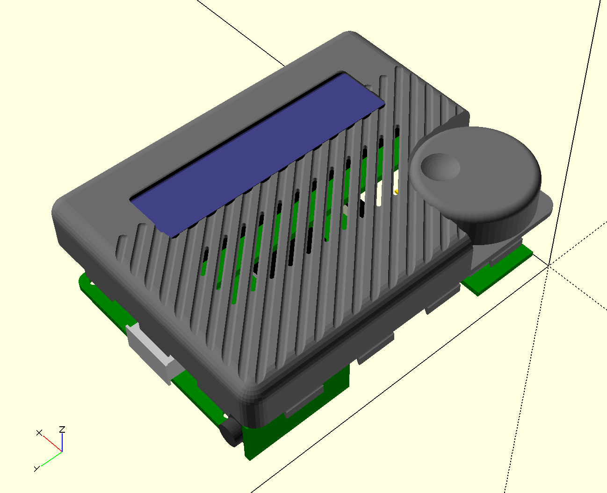
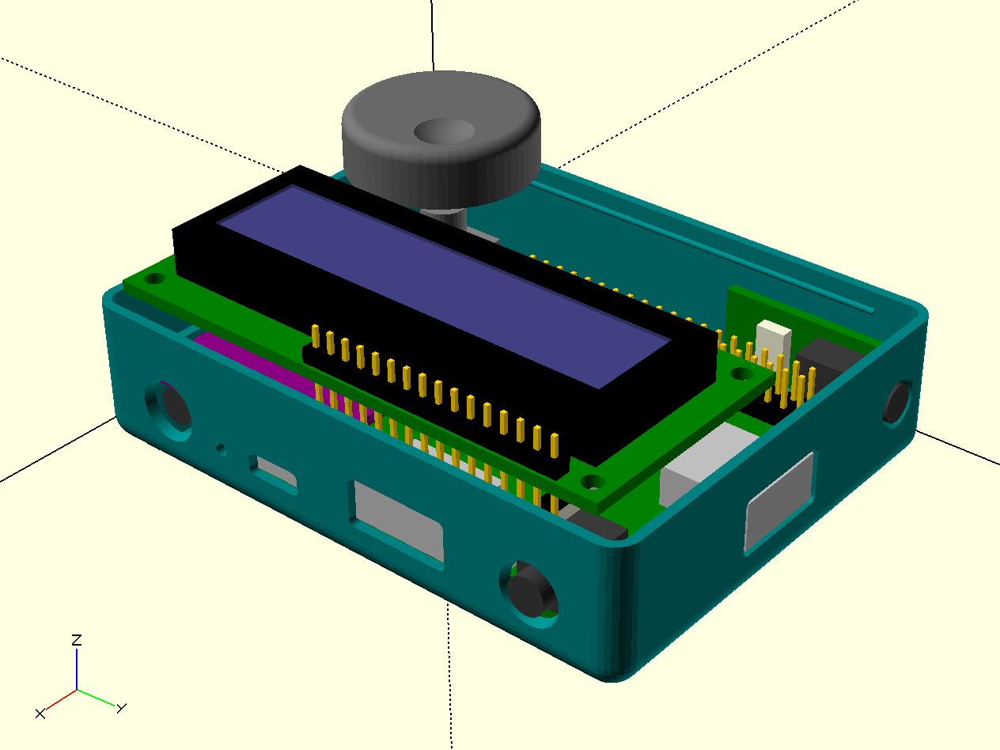
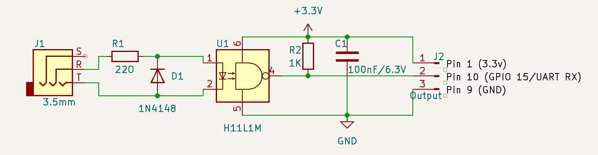
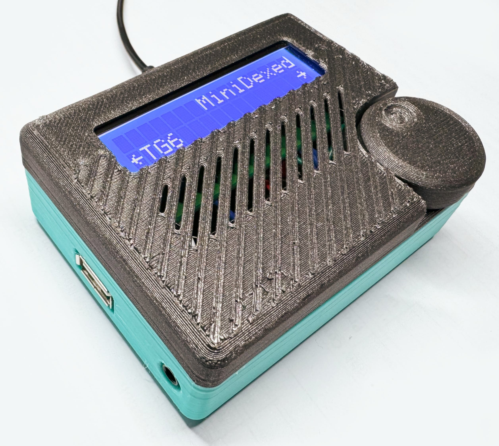

# MiniDexed RPI 3A Case

This is a case for a [MiniDexed] synthesizer built with a Raspberry Pi 3A, a DAC and a custom board for a MIDI IN TRS jack (schematic included in the `kicad-mini-in` folder--I ended up just using a protoboard, so there's no real PCB data for that).

This repository includes the `STL` files for the case (top, bottom and knob), as well as the [OpenSCAD](https://openscad.org) files for the case and all boards (some of which I modified from some of the excellent libraries I keep tabs on [here](https://taoofmac.com/space/apps/openscad)).

There is also an (incomplete) slanted/oblique version of the case, which I may or may not finish.

## MIDI IN Schematic

This is a pretty simple schematic, and I ended up just using a protoboard for it. The TRS jack is a 2.5mm MIDI IN jack, and other than the [`H11L1M`](https://www.onsemi.com/products/interfaces/high-performance-optocouplers/high-speed-logic-gate-optocouplers/h11l1m) optocoupler, everything else is just a few resistors and capacitors:

## Checklist

- [x] Check all screw hole sizes
- [x] Knob
- [x] Deeper top pattern (0.5mm)
- [x] LED hole
- [x] Wider SD card slot inset
- [x] MIDI TRS jack

## Printing Notes

Printed in PLA, 0.2mm layer height, 3 perimeters, 3 top/bottom layers. I used Sunlu PLA+ for the bottom half of the case and Eryone Galaxy Black for the top and knob.

You may want to print the top half of the case with a plain face, but I went for a little more texture (which may or may not work well depending on PLA). I recommend printing the flat face down, and using mouse ear brims to keep it from warping (although the supports will help with that, too).

[MiniDexed]: https://github.com/probonopd/MiniDexed